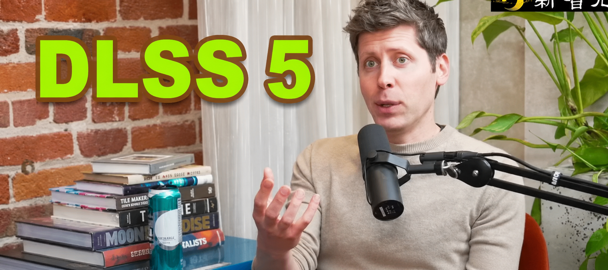

今天看了 DLSS5 的介绍视频，感触良多。

主包曾经也和其他三百多万同学一样，学习过 GAMES101，学习了光栅化，学习了渲染公式，学习了路线追踪，也从零手搓了自己的 Ray Tracing 引擎。曾经也尝试着朝游戏引擎、渲染的方向做职业规划，不过最终还是没走上这条路。

不知道是有幸还是不幸，在我学习这门课的时候，NeRF 和 3D Gaussian 已经现世了，虽然还很原始、很慢、很粗糙，但是这种用数据去暴力重建三维物体的方法，还是给了小小的我很多震撼。当时就边学渲染公式边想，这个如此“经验公式”的东西，未来肯定会被概率方法（神经网络）给取代掉。而现在，未来已来。

顺着刚刚的思路继续发散一下，“经验公式”会被“估得更准”的神经网络给取代。渲染管线再怎么玩 Physically based rendering，无论是把 BRDF 每一项玩出花来，或是引入次表面散射、体积雾这些新鲜建模方法，最终都不如直接把所有数据采集好、洗干净，一股脑丢给神经网络：你去学吧！

图形渲染处在一个比较不上不下的位置，正好在这个时候躺枪。它没有围棋那么规则明确，没有 CV、STT 那么结果明确，不是很容易被组织成适合 AI 去学的形式。但说实话，笔者认为它肯定是没有 LLM 来的难的。因此在 AI 时代，已成为相对的 low hanging fruit，被 Nvidia 盯上，着手攻克了。或许 DLSS5 还只是在渲染管线的最后一步起到一个“realistic 滤镜”的效果，但相信很近的将来，渲染管线会被 AI 大幅重构，与之前我们辛苦学的东西将大相径庭。

在 AI 时代，想要做到上面的“范式迁移”，很重要的一点就是将我们想要重塑的东西，规整成一种“可学习的映射”。LLM 是输入语言，输出语言；Agent 是输入任务、输出任务结果；渲染是输入模型、材质与光照等，输出图像；自动驾驶是输入环境，输出操作指令......

当然诚实地讲，作为玩家，我曾经也是很不喜欢 DLSS 技术的，觉得猜出来的画面是假的，是会影响我的游戏体验的。当时的 DLSS 也确实存在延迟、伪影等各种影响游戏体验的问题。但今天看到 DLSS5，写下这篇笔记的时候，突然就意识到，或许我也应该拥抱这个“猜出来的画面”了。

说了这么多，笔者想表达的是，真正会被淘汰的，从来不是某一种渲染技术，而是“把一切拆成规则去硬算”的那种思维惯性。今天轮到图形学，明天可能就是别的什么领域。DLSS5 是不是所谓“颠覆”其实不重要，重要的是它第一次让无数人亲眼看到：那个靠经验公式去拟合现实的时代，真的开始退场了。而我们要做的，不过是别固执地守在岸上。
