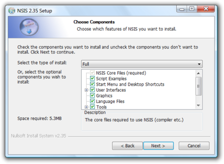
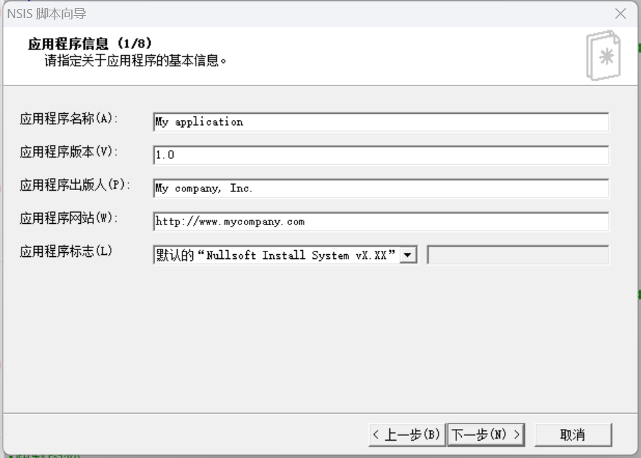

省流：实践解包一个NSIS安装程序，然后重新打包成长的一样的安装程序，但可以偷偷替换安装内容。

## NSIS是什么玩意

> Nullsoft脚本安装系统（英语：Nullsoft Scriptable Install System，缩写：NSIS）为一个开放源代码脚本驱动的封装安装档用工具。可以用其脚本语言自定安装的流程，同时支持多种语系的安装接口。



就是长这个样的一个安装器，相信大家冲浪年头比较久的多少见过。


## 拿什么逆

7zip的15.05版本可以支持直接解压```installer.exe```的文件，解压出```[NSIS].nsi```的明文脚本。笔者猜测是NSIS使用了类似python的技术实现，把命令明文的存进exe里然后安装时执行，所以可以直接用7zip解压。同时也能解压出附带的资源文件等。

当然解压缩之后的脚本是不能用NSIS打包回去的，所以只能自己读懂了代码再重写一份。

解压出来的文件结构
```
.
├─$0
├─$PLUGINSDIR
│   ├─uires
│   ├─System.dll
│   └─Plugin.dll
└─[NSIS].nsi
```
其中```uires```文件夹包含了一个```soui-sys-resource.dll```，以及一些图片文件、xml文件等，猜测这个就是安装器使用的图形库：[https://github.com/SOUI2/soui](https://github.com/SOUI2/soui)

为了复用图形资源，决定继续使用SOUI构建新的安装程序。

## 代码处理：一、递归展开

先把目光放到```[NSIS].nsi```

解压出来一看，我日，一万两千行，这我逆锤子。然后定睛一看，很多地方都是在```SetOutPath xxx```，```File xxx```，就是在往某个路径拷贝文件。
```
  SetOutPath $_OUTDIR\resources\app\node_modules\@sentry\types
  File LICENSE
  File package.json
  SetOutPath $_OUTDIR\resources\app\node_modules\@sentry\types\dist
  File breadcrumb.d.ts.map
  File breadcrumb.js
  File breadcrumb.js.map
  File client.d.ts.map
  ...
```
而且里面还有个要命的```node_modules```，这一个个文件拷贝当然代码长度爆炸。

注意到```$0```文件夹里面是安装完成的目标文件，```$PLUGINSDIR```是安装器相关的文件。就将```$0```更名为```game```，```$PLUGINSDIR```更名为```installer```，里面两个dll是由安装程序自己拷贝过去的，需要我写的拷贝只有```uires``文件夹。

然后更改两处相关代码为
```
SetOutPath $PLUGINSDIR\uires
File /r "installer\uires\"
...
File /r "game\"
```
代码长度一下子锐减到两千行。

## 代码处理：二、读逻辑

代码降到能阅读的长度之后，就该开始读代码了。但用这种方式解包出来的代码，看起来和汇编基本无异了，满面的```StrCpy```、```Push```、```Pop```。像这样：
```
Function func_646
  StrCpy $1 ""
  StrCpy $2 ""
  ReadRegStr $1 HKLM Software\Microsoft\Windows\CurrentVersion\Uninstall\xxx UninstallString
  StrCmp $1 "" label_654
  Push $1
  Call func_label_438
  Pop $2
  StrCpy $1 1
label_654:
  StrCpy $0 ""
  ReadRegStr $0 HKLM Software\Microsoft\Windows\CurrentVersion\Uninstall\xxx UninstallString
  StrCmp $0 "" 0 label_663
  Push ""
  Push ""
  Push ""
  Push $1
  Push $2
  Return
```
但好在还是有突出的地方，比如这里```ReadRegStr```就是一个读注册表的操作。抓住这些核心操作，把大体的安装逻辑看懂就好。

但认真看了后发现事情没那么简单。

正常的NSIS安装程序的编写是，一页一页来的。一个Page选择语言，一个Page看License，一个Page选安装位置等等。但这一个逆出来的程序它完全没有使用内置的Page类型，只有一个```Page custom func_97```。然后在代码中发现很多如```Plugin::InitGUI```、```Plugin::MoveFiles```这种插件调用。这个NSIS安装程序完完全全就是套了个NSIS的壳，前端的操作都是由这一个```Plugin.dll```里的函数完成的。

二进制的dll本身也不是不可以逆，但逆起来就麻烦多了，这里不得不找别法子。

## 代码处理：三、猜语言

逆向有一个很重要的思想是，虽然我们反编译/解包出来的代码看起来乱七八糟，但程序员一开始写的时候肯定还是用比较人性化的方式来写的。比如说你知道这是一个C++程序，虽然在IDA里面逆出来乱糟糟的，但很容易的就可以抛开那些干扰项看程序到底干了什么。

这里先是以SOUI+NSIS作为关键词，在全网很努力的搜索，然后找了半天才找到这么一个Demo

https://github.com/eiaeii/SouiDemo

节选一段：
```
	;/////初始化窗口/////
	setupdll::InitWindow /NOUNLOAD "$PLUGINSDIR"
	Pop $Dialog
	;/////绑定控件与脚本函数对应关系//////
	
	setupdll::FindChildByName /NOUNLOAD "link_agreement"
	Pop $0
	${If} $0 == "-1"
		MessageBox MB_OK ERROR_MESSAGE
	${Else}
		GetFunctionAddress $0 OnLinkAgreementClick
		setupdll::BindControlAndNSISScript /NOUNLOAD  "link_agreement" $0
	${EndIf}

	setupdll::FindChildByName /NOUNLOAD  "btn_custominstall"
	Pop $0
	${If} $0 == "-1"
		MessageBox MB_OK ERROR_MESSAGE
	${Else}
		GetFunctionAddress $0 OnCustomInstallClick
		setupdll::BindControlAndNSISScript /NOUNLOAD  "btn_custominstall" $0
	${EndIf}

	setupdll::FindChildByName /NOUNLOAD "btn_install"
	Pop $0
	${If} $0 == "-1"
		MessageBox MB_OK ERROR_MESSAGE
	${Else}
		GetFunctionAddress $0 OnBtnInstallClick
		setupdll::BindControlAndNSISScript /NOUNLOAD "btn_install" $0
	${EndIf}
```

逻辑上看起来和我逆的那个程序可能是差不多的。同时它也是依赖一个```uires```文件夹来放前端的xml和图片的，只要我把这个项目理一理，照猫画虎的还原我逆的那个程序就好。


但很可惜的是，经过了长时间的努力，这个项目仍然没有成功的跑起来，编译能过，但运行程序后直接不显示窗口。只能继续另寻他法。

在SouiDemo的NSIS脚本里发现了一点端倪。在前三行的注释里

```
; 该脚本使用 HM VNISEdit 脚本编辑器向导产生
```
帮大忙了！从这里发现了有这么一个HM VNISEdit的东西，于是笔者也下了一个，并且用了一下。在VNISEdit里，有一个向导功能，可以图形化的选择要安装的程序、安装的位置，创建卸载程序等等选项，然后它会自动生成一个对应的NSIS代码。



这个生成的代码当然是可以很轻松的跑起来，同时它的逻辑也能满足基本的安装、卸载需求。后续的活只要在这个脚本上把前端搭建起来，就可以了。那么NSIS部分的逆向到此告一段落。

## 代码处理：四、找dll的源码
在上文提到的SouiDemo中，有一个中间编译产物```setupdll.dll```，在从逻辑上看是和前面的逆的```Plugin.dll```是类似的作用，都是负责前端绘制的部分。但SouiDemo编译运行不成功，没法完全相信他。

这里支撑着继续逆下去的信念是，像```Plugin.dll```这类前端产物，肯定是有其对应的"生成器"在的，不会是凭空手搓，一行行代码码出来的。SouiDemo中的```setupdll.dll```的出现更加坚定了这个信念（特别是SouiDemo这个看起来很草台班子的项目不太可能手搓那么一大个dll的代码）

然后就又找啊，找啊。

发现了这个（之前怎么就没搜到呢）

https://github.com/soui4-demo/soui4-nsis

是soui自己的一个小demo，一样也是使用的```setup.dll```，看起来代码也是基本一样的。而且是23年的！！好近！

https://github.com/soui4/soui

尝试复活，跟着README，从SOUI4开始，使用release-win32进行编译，设置SOUI4LIB和SOUI4PATH环境变量，然后打开soui4-nsis的vs工程进行编译。

几个小坑：
* soui4-nsis的```MainDlg.h```里用了```wstring```但没有对应头文件，补上```#include <string>```
* soui4-nsis的一些常量(```GWLWNDPROC```)，查了下只在Win32模式下支持，把它改为x64兼容的常量后又更多报错，因此这个项目用Win32模式编译
* soui4-nsis调用SOUI4编译的产物时，会根据d后缀区分Release和Debug，这两个项目要用一样的Release/Debug选项
* 虽然理论上Win32和x64的dll是可以互相调用的，但为了兼容性考虑，这里SOUI4也选择在Win32下编译
* （重要）在soui4-nsis的setupdll.cpp的27行，在这里设置```uires```文件夹的路径

最后一点可能也是导致前面那个SouiDemo编译不通过的问题。

## 开抄

然后就是比较冗长的开抄环节，安装包无非就是勾选用户协议、选择文件夹、点击安装、启动程序等等，这些在demo中都有原型。照着解包出来的uires的一页一页，重新恢复对应的SOUI逻辑，比如点击某个按钮跳转到下一页，点返回返回前一页；绑定NSIS的操作，等等。然后就可以恢复出一个前端长的一模一样的安装程序了。

## 一些笔记

### FindChildByName
会根据控件的```name```属性寻找，遇到同名的会找到第一个控件。

### 设置控件的enable
通过FindChildByName获取Handle，调用成员函数设置enable/disable
```cpp
// MainDlg.cpp

BOOL CMainDlg::OnInitDialog(HWND hWnd, LPARAM lParam) {
	m_btnInstall = FindChildByName(L"btn_install");
	m_btnInstall->EnableWindow(FALSE,TRUE); // disable
}

void CMainDlg::OnChkAgreementClick() {
    if (m_chkAgreement && m_chkAgreement->IsChecked()) {
        m_btnInstall->EnableWindow(TRUE, TRUE); // enable
    }
    else if (m_chkAgreement && !m_chkAgreement->IsChecked()) {
        m_btnInstall->EnableWindow(FALSE, TRUE); // disable
    }
}
```

### 设置控件对应的操作
通过一个宏，设置某个事件的回调函数
```cpp
// class CMainDlg in MainDlg.h

EVENT_MAP_BEGIN()
	EVENT_NAME_COMMAND(L"chk_agreement",OnChkAgreementClick)
	// 按下 name="chk_agreement "的按钮，调用 CMainDlg::OnChkAgreementClick()
EVENT_MAP_END()
```

### 切换页面
使用SOUI的page控件代替NSIS的page格式，通过tabctrl控件来在page之间切换
```xml
<!-- dlg_main.xml -->
<tabctrl name="tab_main" pos="0,60,-0,-0" curSel="0" focusable="0" animateSteps="0" tabHeight="0" animate="0" >
        <page title="welcome">
          <include src="LAYOUT:XML_WELCOME"/>
        </page>
        <page title="agreement">
          <include src="LAYOUT:XML_AGREEMENT"/>
        </page>
        <page title="installing">
          <include src="LAYOUT:XML_INSTALLING"/>
        </page>
        <page title="finish">
          <include src="LAYOUT:XML_FINISH"/>
        </page>
		<!-- ... -->
      </tabctrl>
```

```cpp
// MainDlg.cpp
BOOL CMainDlg::OnInitDialog(HWND hWnd, LPARAM lParam) {
    m_tabMain = FindChildByName2<STabCtrl>(L"tab_main");
	// ...
    return 0;
}

void CMainDlg::OnLinkAgreementClick() {
	m_tabMain->SetCurSel(1); //show agreement
}
void CMainDlg::OnBtnAgreementSure() {
	m_tabMain->SetCurSel(0); //goto welcome
}
```

### 安装时记录log，卸载按log卸载

（就不会出现大家喜闻乐见的那种装到C盘根目录直接```rm -r```把整个C盘给端了的情况）

但后面考虑到可能安装的那个程序还会产生文件，就还是使用递归删除文件了（希望没事）

https://www.yhxs3344.net/83.html/

### 根据Edit框实时变化改键值

本来像是用类似```onChange```回调来及时修改安装路径，但这样没输入完的时候好像也会一直回调，后面想着在按安装的时候再获取一下edit框的值就好了。


### 开机启动

用NSIS脚本写注册表（勾选的逻辑SOUI负责）
```
; 创建
WriteRegStr HKLM "Software\Microsoft\Windows\CurrentVersion\Run" "AppName" '"$INSTDIR\${PRODUCT_MAIN_EXE}"'
; 删除
DeleteRegValue HKLM "Software\Microsoft\Windows\CurrentVersion\Run" "AppName"
```