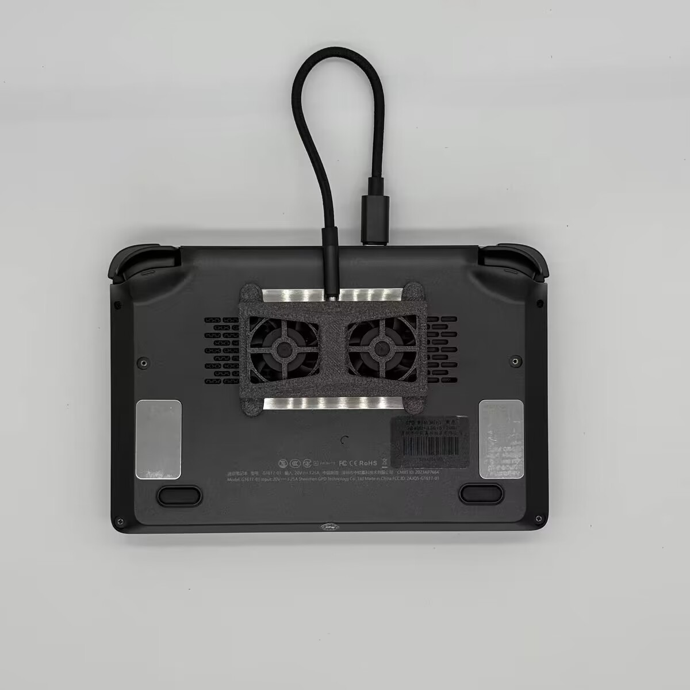
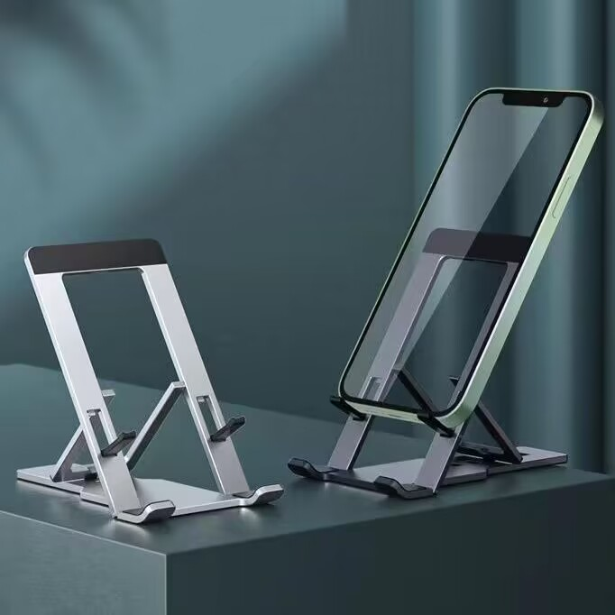

## 28W BIOS

据网上查询到的资料，GPD win mini出厂默认15w的TDP，最高限制在20w。但厂商提供了一份BIOS，刷入之后可以解锁28w的TDP。20w和28w，字面上看差了可是有50%的性能了，不刷一下显得我吃亏好多，于是也刷了这个BIOS。

### 刷固件

笔者在一个gpd的交流群里下载了8840u的固件，读者若有需要可以找gpd的淘宝客服索要28w固件，要注意的是7840的固件与8840的固件是不通用的，刷错了可能会变砖。

解压压缩包后，文件结构如下：
```
.
├── AfuEfi
│   ├── Afu64.nsh
│   ├── AfuEfix64.efi
│   ├── MiniEDP.1.66.GPD.bin
│   └── readme.txt
├── AfuWin
│   └── MiniEDP.1.66.GPD.exe
├── MiniEDP.1.66.GPD.bin
└── checksum.txt
```
然后直接运行```AfuWin/MiniEDP.1.66.GPD.exe```后根据程序指示进行确认等操作，机器会自动重启，直接完成刷BIOS。

也有方法是把efi刷入u盘，然后从u盘启动进行刷固件，笔者直接成功了就没有尝试。

### 改TDP

方法1：刷完28w BIOS后可以直接在体感助手里面进行修改

方法2：进BIOS更改，开机狂按del键进BIOS
```
Advanced - AMD CBD - SMU Common Options - SmartShift Control
```
将下面三个数字均改为28000，F4保存退出。

如果在刷固件之前在BIOS中进行修改，是会显示28000超出限制不让修改的。但刷之前在体感助手中改没有失败提示，所以通过BIOS修改也是检测是否刷成功的方法之一。

## Windows
### 仿S3睡眠
S3睡眠是让机器只保留内存供电，其他设备全部断电，以实现低功耗、快启动的我全都要的效果。相比之下S4休眠启动慢，S0睡眠功耗高，都不令人满意。

GPD win mini这台掌机的BIOS里是有支持S3的开关的，但在BIOS开启，windows开启支持后，却出现无法唤醒的情况，根据查到的资料猜测是AMD的显卡驱动没能醒来，因此标准的S3就没法使用了。

经群友的尝试，修改以下选项后，可以实现关闭CPU、休眠风扇停转、低功耗待机、快速唤醒的休眠，算是S3的一个平替了。

```
Advanced - AMD CBS - CPU Common Options - Global C-State Control - Enable
Advanced - AMD PBS - Power Saving Configurations - Morden Standby Type - S0i3 with workaround
```

如果遇到醒不来的情况，在设备管理器-音频设备中，禁用AMD的两个音频设备，可能就修好了。

### 修改显存
某一次点开任务管理器，发现“为硬件保留的内存”足足有8.2G，即使笔者买的是32G的机器，还是很肉疼。一开始以为是Windows的错误设置导致有整整8G的内存不能使用，经过了一番设置、重装，还是无法撼动这8.2G。后面和群友一交流才想起来8840u是核显，这8G是划分给780m作为显存使用的，白折腾了。

要修改显存的话，可以通过BIOS如下路径修改：
```
Advanced - AMD CBS - NBIO Common Options GFX Configuration - UMA Frame buffer Size
```

## SteamOS
> 我有steamdeck了！

至于为什么要装这个SteamOS，最重要的点是上面Windows下的休眠还是不尽人意。

私以为作为游戏机最基本的也该做到开机即玩，像ns那样点开就是游戏。在Windows系统里慢吞吞的开机、慢吞吞的开Steam、慢吞吞的开游戏、进游戏，早就磨灭打游戏的欲望了。SteamOS就可以实现像SteamDeck一样的开机即玩，这才像是一个游戏机嘛。

经过测试，SteamOS的默认睡眠就能做到合盖后风扇停转，可以放心的塞包里。同时开盖在一秒左右快速还原游戏界面，绝大部分游戏都可以直接正常继续玩。 爽！

### 装系统
选择了一个基于SteamOS魔改的ChimeraOS魔改的Sk-ChimeraOS。但反而因为汉化有一些坑，后面会提到。

Sk-ChimeraOS的文档：https://flowus.cn/honjow/share/a865ae01-3bc2-426a-981b-3f16a589cc61
参考的视频教程：https://www.bilibili.com/video/BV1CQ4y1V76

使用u盘引导的安装方法只能整盘安装，不支持单硬盘多系统，就根据视频教程使用DiskGenius进行系统安装，实现双系统。

1. 下载磁盘镜像 [下载链接](https://ns.switchsystem.eu.org/guest/stos/SK-ChimeraOS) （如果链接失效了就去文档里翻一下新的）
2. 在win的磁盘管理中，压缩卷。笔者这里是按0.3T/1.5T/0.2T分卷，游戏装在1.5T的盘里Windows和SteamOS共用，留200G全部给SteamOS的系统及Steam；
3. 用DiskGenius进行初步调整。笔者的硬盘上还有16G的恢复分区在磁盘的最后面，先用dg把它往前移。让200G空间全部在磁盘末尾；
4. 用dg打开磁盘镜像；
5. 查看镜像的两个分区，记住下方信息的“总扇区数”，后面要用；
6. 点回硬盘，在上面的灰条部分右键-创建新分区
    * 文件系统类型：EFI system partition
    * 详细信息-总扇区数：输入efi分区的总扇区数
    * 隐藏 + 无盘符
7. 保存分区，不进行格式化
8. 在磁盘镜像的efi分区上右键-克隆分区，复制所有扇区，克隆到刚创建的分区
9. 重新执行6-8对系统分区进行克隆
    * 文件系统类型：Linux data partition
    * 总扇区数：镜像另一个分区的总扇区数
    * 不勾选隐藏和无盘符
然后就可以直接重启到SteamOS了。

SteamOS的系统分区在检测到自己小于50G的时候，会自行进行扩容，扩张到所有可用空间的大小。因此我们不用调整克隆过去的系统分区大小，同时也是把磁盘末尾所有扇区都留给SteamOS的原因。

### decky
虽然奇美拉OS说是开箱即用，但实际上还是遇到了问题。

安装decky的指令：墙内镜像
```bash
curl -L http://dl.ohmydeck.net | sh
```
原版：https://decky.xyz/ 点下载，然后双击运行

在右边不显示小插头图标：[帖子链接](https://ohmydeck.net/d/4/34)

> 对于当前的 v2.4.5 稳定版本 Plugin Loader，如果修改过 locale 区域设置（比如所谓中文字库），会导致无法显示插件。此 Issue 已被 https://github.com/SteamDeckHomebrew/decky-loader/pull/284 修复但未更新到当前版本，请使用下列命令安装修复版本 Plugin Loader：

```bash
curl -L https://files.ohmydeck.net/fix.sh | sh
```

笔者使用这个fix的时候链接挂了，最后使用的是官网的桌面installer，然后安装prerelease版本，成功修复。

## 配件

### 散热器

由于改了28w的TDP，会变得非常烫手。在网上调研了一番，PureDIY、冷恤等等的改装方案，或是没赶上车或是不太满意。后面选择了这一种外置磁吸散热风扇。

<center></center>

本来是想根据网上找到的模型自行进行3D打印与组装的，纯物料成本在60块左右，但可惜笔者当时在外地实习，没有电烙铁等设备，加上设备成本就比买成品高了，最后还是120r买了网上的成品。

[模型与DIY教程链接](https://makerworld.com/zh/models/429086#profileId-333401)

### 支架

GPD和别的笔记本一样从D面进风，不能直接摆床上玩（不爽！）

于是买了个支架，同时也可以支持像是把GPD放桌面，再连一个手柄玩的场景。

<center></center>

拼多多14.35拿下